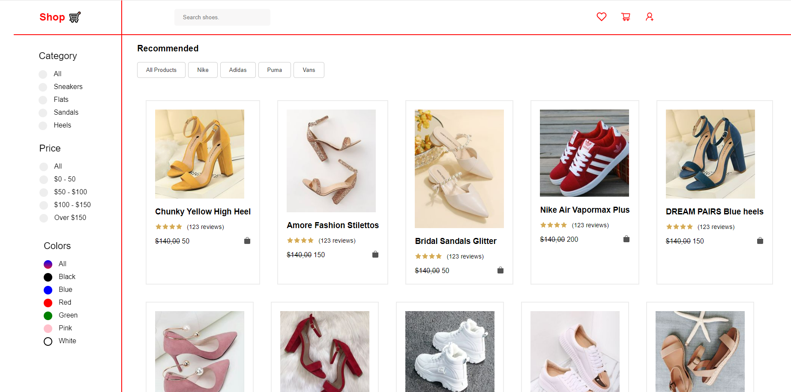

# Shop Search & Filter App

This React.js application enhances the shopping experience by providing search and filter functionalities. Whether users are browsing for specific products or refining their search criteria, this app offers a seamless experience, improving discoverability and user satisfaction.

## Features:
- **Search:** Quickly find desired products by typing keywords into the search bar.
- **Filtering:** Refine search results based on various attributes such as price range, category, brand, and color.

## Tech Stack:
- **React.js:** Frontend framework for building dynamic user interfaces.
- **JavaScript/JSX:** For programming logic and component rendering.
- **CSS/SCSS:** Styling and layout customization.
- **Redux (optional):** State management for scalable applications.

## Usage:
1. Clone the repository.
2. Install dependencies using `npm install`.
3. Start the development server with `npm start`.
4. Access the application in your browser at [http://localhost:3000](http://localhost:3000).
